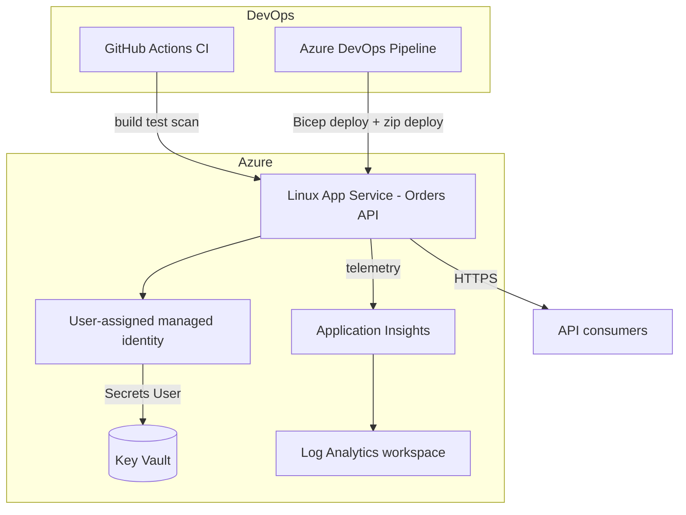
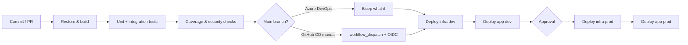

# .NET on Azure — CI/CD & Infrastructure Reference

[](https://github.com/psachn-coder/dotnet-azureci-cd-reference/actions/workflows/ci.yml)
[](LICENSE)

A **public portfolio repository** that demonstrates production-style delivery for a small **ASP.NET Core** API on **Azure**: automated tests, container builds, modular **Bicep**, **Azure DevOps** YAML (with reusable templates), and **GitHub Actions** CI/CD (including OIDC-based deployment).

**Runtime:** This sample targets **[.NET 10](https://dotnet.microsoft.com/)** (current LTS at time of authoring). The API is intentionally small so reviewers can focus on pipelines and infrastructure.

---

## What this demonstrates

| Area | Highlights |
|------|------------|
| Application | Orders Web API, `/health`, Swagger/OpenAPI, structured logging, Key Vault configuration hook, Application Insights via OpenTelemetry |
| Quality | xUnit unit + integration tests (`WebApplicationFactory`), coverage collection in CI |
| Containers | Multi-stage Dockerfile (non-root user), `docker-compose` for local runs |
| IaC | Modular Bicep: Log Analytics, Application Insights, Key Vault (RBAC), user-assigned managed identity, Linux App Service |
| Azure DevOps | Build → test → coverage → optional SonarCloud → Bicep what-if/deploy → dev → **gated** prod |
| GitHub Actions | Free-tier CI (build, test, CodeQL, dependency review, Docker build); manual CD with `azure/login` OIDC |

---

## Architecture (Azure)



---

## Pipeline flow



GitHub **CI** runs automatically on push/PR. GitHub **CD** runs only when you trigger it and Azure secrets are configured (see [docs/github-actions-setup.md](docs/github-actions-setup.md)).

---

## Repository structure

```text
.
├── src/Orders.Api/              # ASP.NET Core Web API
├── tests/                       # Unit + integration tests
├── infra/bicep/                 # Modular Bicep + dev/prod parameter files
├── .azuredevops/templates/      # Reusable Azure DevOps steps
├── azure-pipelines.yml          # Multi-stage Azure DevOps pipeline
├── .github/workflows/           # CI (automatic) and CD (manual)
├── Dockerfile / docker-compose.yml
└── docs/                        # Setup guides for Azure DevOps & GitHub OIDC
```

---

## Run locally

### Prerequisites

- [.NET 10 SDK](https://dotnet.microsoft.com/download)
- Optional: Docker Engine for container workflow

### CLI

```bash
dotnet restore Orders.sln
dotnet build Orders.sln -c Release
dotnet test Orders.sln -c Release
dotnet run --project src/Orders.Api/Orders.Api.csproj
```

- Swagger UI: `http://localhost:5xxx/swagger` (port from console output)
- Health: `GET /health`
- Sample: `POST /api/orders` with JSON `{ "customerName": "Contoso", "productSku": "SKU-1", "quantity": 2, "unitPrice": 9.99 }`

### Docker

```bash
docker compose up --build
```

API: `http://localhost:8080/swagger`

### Configuration

| Setting | Purpose |
|---------|---------|
| `KeyVault__Uri` | When set, loads secrets from Key Vault using `DefaultAzureCredential` |
| `APPLICATIONINSIGHTS_CONNECTION_STRING` | Enables Azure Monitor OpenTelemetry exporter |
| `OpenTelemetry__ServiceName` | Service name tag for telemetry resources |

---

## Deploy to your own Azure subscription

### 1. Resource groups

Create (or let the pipeline create) resource groups, e.g. `rg-orders-dev` and `rg-orders-prod`.

### 2. Validate Bicep locally

```bash
az bicep build --file infra/bicep/main.bicep
az deployment group what-if \
  --resource-group rg-orders-dev \
  --template-file infra/bicep/main.bicep \
  --parameters @infra/bicep/parameters/dev.bicepparam
```

### 3. Deploy infrastructure

```bash
az deployment group create \
  --resource-group rg-orders-dev \
  --template-file infra/bicep/main.bicep \
  --parameters @infra/bicep/parameters/dev.bicepparam
```

Note deployment outputs (`webAppName`, `keyVaultName`, `managedIdentityClientId`).

### 4. Deploy the application

```bash
dotnet publish src/Orders.Api/Orders.Api.csproj -c Release -o ./publish
cd publish && zip -r ../orders-api.zip .
az webapp deployment source config-zip \
  --resource-group rg-orders-dev \
  --name <webAppName-from-bicep-output> \
  --src ../orders-api.zip
```

### 5. Wire CI/CD

- **Azure DevOps:** [docs/azure-devops-setup.md](docs/azure-devops-setup.md) — service connection, variable group, environments with approvals.
- **GitHub Actions OIDC:** [docs/github-actions-setup.md](docs/github-actions-setup.md) — federated credential, secrets, environment protection.

---

## Cost guidance (not a price quote)

Choices in this repo skew toward **low cost / free-tier friendly** demos:

| Resource | Dev-oriented SKU in parameters | Notes |
|----------|-------------------------------|--------|
| App Service Plan | **B1** (Basic) | Always-on capable; not free, but inexpensive for demos |
| App Service Plan (prod sample) | **P1v3** | Production-shaped; scale down in `prod.bicepparam` for sandboxes |
| Application Insights | Pay-as-you-go | Generous free data allowance for small workloads |
| Log Analytics | PerGB2018 | Retention 30d dev / 90d prod in Bicep |
| Key Vault | Standard | Secrets operations are low cost at demo scale |

Review [Azure pricing](https://azure.microsoft.com/pricing/) and tear down sandboxes when idle.

---

## Security practices

- **Managed identity** for the web app; no application secrets in source control.
- **Key Vault** with **RBAC** (`Key Vault Secrets User` for the app identity).
- **HTTPS-only** App Service, TLS 1.2+, FTPS disabled in Bicep.
- **OIDC federation** for GitHub CD (no long-lived Azure client secrets in GitHub when configured correctly).
- **Branch protection** (recommended): require PR reviews, required CI checks, block force-push on `main`.
- **Environment approvals** for production in Azure DevOps and GitHub Environments.

---

## Need this for your project?

This repository is a reference implementation for a fixed-price engagement:

> **I will set up a CI/CD pipeline for your .NET app on Azure**

**Upwork:** [https://www.upwork.com/freelancers/~01ad9e4718b822e5d8](https://www.upwork.com/freelancers/~01ad9e4718b822e5d8)

---

## License

[MIT](LICENSE)
